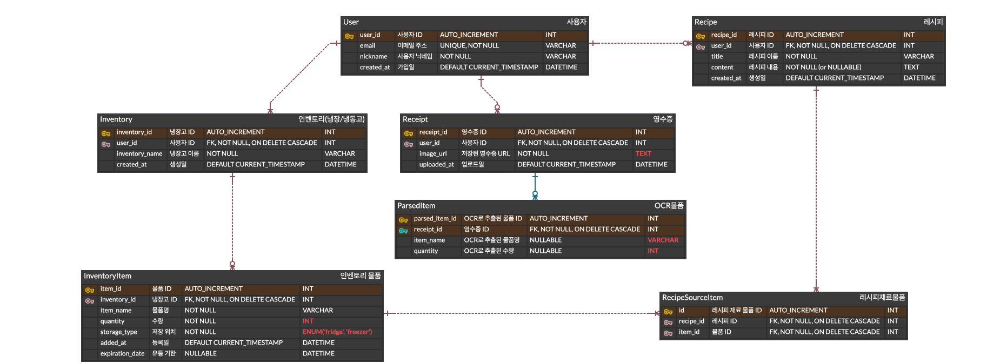

# **PROJECT PROPOSAL**

| Item          | Details                                                                 |
|---------------|-------------------------------------------------------------------------|
| **Course**        | Open Source Software Basic                          |
| **Class**        | 3 |
| **Submitted on**  | April 1, 2025                                                           |
| **Owner**         | 하경준 |
| **Members**       | 곽태훈, 한승진, 이예권 |

 

## **Getting Started**
Basic tutorials for using and developing the service can be found in the [**USER GUIDE**](user-guide.md) and [**DEVELOPER GUIDE**](developer-guide.md), respectively. 
The complete source code for this service is also available [**HEAR**](./source-code).  

## Final Report
The following content is based on the project proposal and may differ from the actual implementation. For accurate details, please refer to [**the final report**](oss-basic-final-report.pdf).

 

# **CONTENTS**

* [**1. TEAM**](#1-team)   
  * [**1.1. MEMBERS**](#11-members)   
  * [**1.2. TOOLS FOR COOPERATION**](#12-tools-for-cooperation)   

* [**2. PROJECT INFO.**](#2-project-info)   
  * [**2.1. PROJECT NAME**](#21-project-name)   
  * [**2.2. PROJECT ICON**](#22-project-icon)   
  * [**2.3. PROJECT OVERVIEW**](#23-project-overview)   
    * [**2.3.1 BACKGROUND**](#231-background)   
    * [**2.3.2 SERVICE TARGET**](#232-service-target)   
    * [**2.3.3 BENEFITS**](#233-benefits)   

* [**3. REQUIREMENTS SPECIFICATION**](#3-requirements-specification)   
  * [**3.1. KEY FEATURES**](#31-key-features)   
    * [**3.1.1. PURPOSE AND IMPLEMENTATION**](#311-purpose-and-implementation)   
    * [**3.1.2. INPUT/OUTPUT AND EXCEPTION HANDLING**](#312-inputoutput-and-exception-handling)   
  * [**3.2. EXTENSION**](#32-extension)   
    * [**3.2.1. PURPOSE AND IMPLEMENTATION**](#321-purpose-and-implementation)   
    * [**3.2.2. INPUT/OUTPUT AND EXCEPTION HANDLING**](#322-inputoutput-and-exception-handling)   
  * [**3.3. ERD (Entity-Relationship Diagram)**](#33-erd-entity-relationship-diagram)   
  * [**3.4. UX/UI (WIREFRAME)**](#34-uxui-wireframe)   

* [**4. DEVELOPMENT STRATEGY**](#4-development-strategy)   
  * [**4.1. DEVELOPMENT METHODOLOGY & TASK ALLOCATION**](#41-development-methodology--task-allocation)   
  * [**4.2. SCHEDULE (MILESTONE)**](#42-schedule-milestone)   
  * [**4.3. TESTING PLAN**](#43-testing-plan)   

* [**5. RISK ASSESSMENT & MITIGATION**](#5-risk-assessment--mitigation)   

* [**6. REFERENCES & TERMS**](#6-references--terms)   
  * [**6.1 REFERENCES**](#61-references)   
  * [**6.2 TERMS**](#62-terms)   

 

# **1. TEAM**

## **1.1. MEMBERS**

| **Name**   | **Position**                           |
|------------|----------------------------------------|
| **곽태훈**     | UX/UI Design & Front-end (FE)         |
| **이예권**     | UX/UI Design & Front-end (FE)         |
| **하경준**     | PM & Back-end (BE)                    |
| **한승진**     | Database Design & Back-end (BE)       |

## **1.2. TOOLS FOR COOPERATION**

| **Tool**   | **Purpose**                                                  |
|------------|---------------------------------------------------------------|
| **FIGMA**     | Sharing UX/UI designs and wireframes                          |
| **GITHUB**    | Sharing the entire project source code and version control    |

 

# **2. PROJECT INFO.**

## **2.1. PROJECT NAME**

  "싹싹정리"   
기분이 좋거나 일이 잘 풀렸을 때 사용하는 유행어인 “싹싹김치”에서 착안하여, 냉장고 재고를 ‘싹싹’ 정리하고 관리한다는 의미

## **2.2. PROJECT ICON**

  

## **2.3. PROJECT OVERVIEW**

### **2.3.1 BACKGROUND**

현대 사회에서는 **식재료 낭비와 가정 내 음식물 쓰레기**가 중요한 사회적 문제로 인식되고 있다. 특히 냉장고 속에 어떤 재료가 있는지 잊고, 유통기한이 지난 식재료를 폐기하는 일이 흔하며 이는 가계의 불필요한 지출로 이어지게 된다. 서울특별시에 따르면, 한국 가정에서 발생하는 음식물 쓰레기 중 약 34%가 유통기한 경과 식재료에서 발생하며, **연간 약 1조 원 이상의 음식물 쓰레기 처리 비용이 지출**되고 있다. 또한 식재료를 직접 관리하지 않고 방치하는 것은 **탄소배출 증가**와 **자원 낭비**로 이어져, 결국 환경 문제에도 영향을 미치게 된다.

기존의 재고 관리 앱은 대부분 **식재료를 수동으로 등록**해야 하며, 이 과정이 번거로워 장기 사용이 어렵다는 피드백이 많다. 이를 해결하기 위해 본 프로젝트에서는 **OCR (Optical Character Recognition)** 기술을 활용하여 **영수증 사진 한 장으로 식재료 정보를 자동으로 인식·입력**하는 방식을 도입할 예정이다. 또한, 단순 재고 관리에 그치지 않고, **보유 식재료 기반의 레시피 추천(GPT API)** 기능을 제공하여 일상에서 실질적으로 도움이 되는 서비스를 통합적으로 제공할 계획이다.

   
  <em>Figure 1: 음식물 쓰레기 발생 원인 비율, 서울특별시</em>

   
  <em>Figure 2: 음식물 쓰레기 발생량과 처리 비용 추이 (2018–2023), 환경부·통계청 자료</em>

### 2.3.2 SERVICE TARGET

**A) 1인 가구 및 자취생**
- 냉장고를 효율적으로 사용하는 데 어려움을 겪으며, 유통기한 경과로 식재료를 자주 버리는 경향이 있다.
- 또한 요리를 자주 하지 않아 냉장고 속 식재료 활용률이 낮은 편이다.

**B) 맞벌이 부부 및 바쁜 직장인**
- 장을 봐도 어떤 재료가 남아 있는지 기억하기 어렵고, 냉장고 속 재료를 중복 구매하는 경우가 많다.
- 식재료를 효율적으로 사용하고 싶은 욕구는 있지만, 이를 위한 시간과 관리 역량이 부족하다.

**C) 평소 집에서 요리하는 것을 즐기는 사람**
- “지금 내 냉장고에 있는 재료로 무엇을 만들 수 있을까?”라는 고민이 많다.

 

### 2.3.3 BENEFITS
**A) 식재료 관리 편의성 증가**
- OCR 기반 자동 입력 기능을 통해, 사용자는 더 이상 냉장고 재고를 하나부터 열까지 모두 수동으로 입력할 필요가 없다.
- 잘못된 OCR 추출 결과도 사용자가 직접 수정할 수 있도록 UI를 제공한다. 

**B) 식재료 낭비 방지 및 환경 보호 효과**
- 단순한 재고 기록 기능을 넘어, 실질적인 식재료 소비 유도
- 사용자가 보유 중인 재고를 기반으로 AI 레시피 추천 기능(GPT API)을 제공하여, 불필요한 폐기를 줄이고 식재료를 낭비 없이 효율적으로 활용하도록 돕는다.

 

# **3. REQUIREMENTS SPECIFICATION**

## 3.1. KEY FEATURES

### 3.1.1. PURPOSE AND IMPLEMENTATION

| **주 기능**           | **목적**                                    | **구현**                                                                                      |
|------------------------|---------------------------------------------|-----------------------------------------------------------------------------------------------|
| **영수증 이미지 업로드**    | 오프라인 구매 물품 정보 추출                 | 실시간 영수증 촬영, 저장된 이미지 업로드                                                      |
| **OCR API**               | 영수증 이미지로부터 구매 물품, 수량, 날짜 추출 | 오픈소스 API 활용, 파싱 로직을 통해 '물품명', '수량', '구매일자' 정제 및 추출                 |
| **물품 등록 및 재고 관리**| OCR 결과 기반 물품 자동 입력                | 각 물품은 '물품명', '수량', '구매일자' 스키마로 RDBMS 저장, 사용자가 직접 수정 가능           |
| **재고 목록 확인**         | 보유 중인 물품 확인                          | 냉장/냉동 탭 분류, 유통기한/구매일자 순 정렬, 태그 기반 필터링 제공                          |
| **레시피 제안**            | 보유 재료 기반 레시피 추천                   | GPT API 활용, 보유 물품 기반 프롬프트 생성                                                   |
| **사용자 계정 관리**      | 사용자별 재고 정보 및 설정 관리              | 소셜 로그인(Google, Kakao) 연동                                                              |

### 3.1.2. INPUT/OUTPUT AND EXCEPTION HANDLING

| **기능**               | **입출력**                                                       | **예외 처리**                                              |
|------------------------|-------------------------------------------------------------------|-------------------------------------------------------------|
| **영수증 이미지 업로드**   | **입력:** 이미지 파일(JPEG, PNG)    **출력:** OCR 처리 결과 (성공/부분 성공/실패) | 이미지 용량 초과, 포맷 오류 시 각각 메시지 출력           |
| **OCR API**               | **입력:** 이미지 파일   **출력:** 텍스트 데이터(물품명, 수량, 구매일자 등)      | OCR 실패 또는 필수 정보 누락 시 수기 입력 유도             |
| **물품 등록 및 재고 관리** | **입력:** 물품명, 수량, 구매일자, 저장위치(냉장/냉동), 유통기한   **출력:** DB 반영 | 필수 정보 누락 또는 재고 없음 시 안내 메시지 출력          |
| **재고 목록 확인**         | **입력:** 정렬/필터 조건   **출력:** 조건에 맞는 재고 목록 리스트업             | 조건 일치 항목 없을 시 안내 메시지 출력                    |
| **레시피 제안**            | **입력:** 사용자의 보유 또는 선택한 재료   **출력:** 요리 제목, 재료, 요약 레시피 | 재료 부족 시 '추천 가능한 레시피 없음' 메시지 출력         |
| **사용자 계정 관리**       | **입력:** 소셜 로그인 토큰   **출력:** 로그인 성공 여부 및 세션 생성           | 이메일 중복, 비밀번호 오류 시 각각 거부 안내 메시지 출력   |

## 3.2. EXTENSION

### 3.2.1. PURPOSE AND IMPLEMENTATION

| **확장 기능**      | **목적**                                 | **구현**                                                                 |
|--------------------|------------------------------------------|--------------------------------------------------------------------------|
| **유통기한 알림**       | 유통기한이 임박한 식재료 알림 전달         | 유통기한 정보가 있는 경우, 해당 유통기한 기준 N일 전부터 푸시 알림 전송 |

### 3.2.2. INPUT/OUTPUT AND EXCEPTION HANDLING

| **확장 기능**      | **입출력**                                                  | **예외 처리**                                   |
|--------------------|-------------------------------------------------------------|--------------------------------------------------|
| **유통기한 알림**       | **입력:** DB에 저장된 식재료 유통기한   **출력:** 알림 메시지 출력           | 유통기한 정보 없음/알림 거부 설정 시 알림 제외         |

## 3.3. ERD (Entity-Relationship Diagram)

서비스의 대략적인 ERD입니다. MVP 기준 가장 핵심적인 기능인 영수증 업로드, 냉장고 및 재고 관리, 사용자 계정 기반으로 우선 설계하였으며, 추후 세부 기능에 따라 확장될 예정입니다.

  

 

## 3.4. UX/UI (WIREFRAME)

서비스 UX/UI에 대한 초기 와이어프레임입니다. MVP 기능을 기준으로 화면을 설계하였으며, 이후 디자인 세부 요소나 애니메이션 등은 개선될 수 있습니다.

- 로그인/회원가입  
  

- 대시보드/홈  
  

- 영수증 OCR  
  

- 재고 관리  
  

- 레시피 추천  
  

- 계정 관리  
  

 

# **4. DEVELOPMENT STRATEGY**

## 4.1. DEVELOPMENT METHODOLOGY & TASK ALLOCATION

| **TASK**              | **TECHNICAL LEAD** | **FRAMEWORK**           | **PURPOSE**                                  |
|-------------------|----------------|----------------------|-------------------------------------------|
| **Front-end (FE)**    | 곽태훈, 이예권 | Figma, Vue.js, Vite | UI/UX 설계 및 시각화, 빠른 유지보수 지원     |
|                   |                | Creati.ai           | 시각적 요소 보조                          |
| **Back-end (BE)**     | 한승진, 하경준 | SpringBoot, MySQL   | 데이터베이스 연동, 보안 및 소셜 로그인 기능 구현 |
| **Project Managing**  | 하경준         | -                    | 일정 및 역할 분배, 통합 관리               |
| **통합 테스트**        | 팀원 전체       | -                    | 기능 통합 후 전체 테스트 수행              |

## 4.2. SCHEDULE (MILESTONE)

| **WEEK** | **DATE**            | **WHAT TO DO**                                                        |
|------|-----------------|------------------------------------------------------------------|
| **5주차** | 25/04/01         | 기획 및 프로젝트 제안서 작성, 팀 내 역할 분담                         |
| **6주차** | 25/04/02~04/09  | ERD 및 API 설계, 로그인/회원가입, DB 구축                          |
| **7주차** | 25/04/09~04/16  | 영수증 업로드 기능, OCR API 연동, 전처리 및 예외처리 로직 설계         |
| **8주차** | 25/04/16~04/23  | 중간고사                                                         |
| **9주차** | 25/04/23~04/30  | 물품 등록 기능, 재고 확인 화면 구현, 재고 DB 완성                    |
| **10주차**| 25/04/30~05/07  | GPT 기반 레시피 추천 기능 연동 및 추천 UI 설계                     |
| **11주차**| 25/05/07~05/14  | 통합 테스트 시작, 주 기능 오류 수정 및 레이아웃 통일                  |
| **12주차**| 25/05/14~05/21  | 통합 테스트 점검 및 마무리 정리                                   |
| **13주차**| 25/05/21~05/28  | 통합 테스트 완료, 발표 자료(PPT/시연 영상) 제작                     |
| **14주차**| 25/05/28~06/04  | 최종 발표 및 시연, GitHub 정리 및 결과 보고서 정리                   |
| **15주차**| 25/06/04~06/11  | 기말고사                                                         |

## 4.3. TESTING PLAN

| **TEST**              | **PURPOSE**                                 | **WHAT**                        | **WHEN**           |
|-------------------|--------------------------------------|-----------------------------|----------------------|
| **단위 테스트 (Unit Test)**  | 각 기능 모듈의 개별 동작 확인               | 로그인, OCR, DB 등록, 재고 확인, 레시피 추천 | 개발 직후             |
| **통합 테스트 (Integration Test)** | 기능 간 연결 동작 확인                     | OCR → 등록 → 확인 → 추천       | 주 기능 개발 완료 후  |
| **사용자 테스트 (UX Test)**       | UI/UX 사용성 확인                        | 전체 UI 흐름, 주요 기능        | MVP 개발 이후        |
| **회귀 테스트 (Regression Test)** | 기능 수정/추가 이후 기존 기능 정상 작동 여부 | 전 기능                      | 통합 개발 완료 후     |
| **시연 시나리오 테스트 (Demo Scenario Test)** | 최종 발표를 위한 시나리오 테스트        | 유저 시나리오 중심           | 최종 발표 전          |

 

# **5. RISK ASSESSMENT & MITIGATION**

| **위험 상황**                    | **설명**                                                     | **방안**                                                                 |
|-----------------------------|----------------------------------------------------------|----------------------------------------------------------------------|
| **낮은 OCR 인식률**             | 구겨진 영수증, 인쇄 품질, 촬영 상태에 따라 인식 정확도 저하 | 사용자 수동 수정 UI 제공, 이미지 전처리 적용(흑백 변환, 회전 등)         |
| **GPT API 활용 실패**           | 프롬프트 생성 복잡도나 API 연동 문제 가능성                | 초기엔 정적 샘플 레시피 사용, GPT 연동은 MVP 완료 이후 도입                 |
| **개발 일정 지연**              | 시험 기간과 겹쳐 개발 시간 부족 가능성                    | 역할 분담 세분화, 마일스톤 기반 일정 관리, 주 2회 회의로 진행 상황 공유 및 피드백 |

 

# **6. REFERENCES & TERMS**

## **6.1 REFERENCES**

\[1\] 서울특별시. (n.d.). *서울시 음식물류 폐기물 발생량 및 처리현황
통계.* 서울 열린데이터광장. 

\[2\] 환경부, & 한국환경공단. (2023). *전국 폐기물 발생 및 처리 현황.*

\[3\] 오순도순. (2023, November 30). *\[OCR/AI\] 2023년 최신판 OCR 8가지
API 비교평가 테스트.* DevOcean.
https://devocean.sk.com/blog/techBoardDetail.do?ID=165524&boardType=techBlog

\[4\] OpenAI. (n.d.). *Text generation and prompting*. OpenAI Platform.
https://platform.openai.com/docs/guides/text?api-mode=chat

## **6.2 TERMS**

**OCR (Optical Character Recognition)**

- 이미지 속 문자 영역을 인식하여 디지털 텍스트로 변환하는 기술

- 본 프로젝트에서는 영수증 이미지를 분석하여 구매 항목, 수량, 구매일자
  등을 추출하기 위해 사용

**MVP (Minimum Viable Product)**

- 최소한의 기능만으로 서비스의 핵심 가치를 제공할 수 있는 초기 제품을
  의미

- 본 프로젝트에서는 OCR 기반 재고 등록, 재고 확인, 기본 계정 기능이
  포함된 버전이 해당
