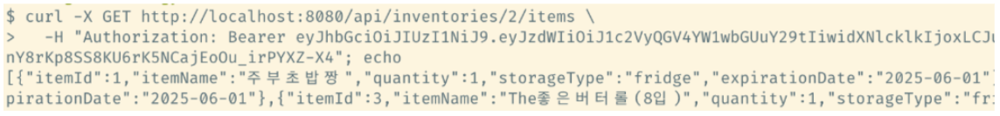

# 개발자 가이드

본 문서는 이 프로젝트를 커스터마이즈하고 싶은 개발자를 위한 가이드입니다. OCR 기반 냉장고 재고 자동 등록 및 레시피 추천 서비스의 백엔드 프로젝트를 로컬 환경에서 실행하고 테스트하는 방법을 주로 안내합니다. 사용자는 영수증 이미지 업로드를 통한 자동 재고 등록, JWT 기반 사용자 인증, GPT를 활용한 개인 맞춤형 요리 레시피 생성기능을 로컬에서 테스트할 수 있습니다. **Postman** 또는 **curl**을 통해 각 API를 테스트할 수 있도록 구성되어 있습니다.

## 백엔드 프로젝트 구조
~~~
backend/
├── build/                             # 빌드 산출물 디렉토리
├── gradle/                            # Gradle Wrapper 설정
│   └── wrapper/
├── src/
│   └── main/
│       ├── java/
│       │   └── com.example.backend/
│       │       ├── config/            # Spring Security, Firebase, Web 설정
│       │       ├── controller/        # REST API 컨트롤러 클래스 모음
│       │       ├── dto/           # 요청(Request) 및 응답(Response) DTO 클래스
│       │       │   ├── request/
│       │       │   └── response/
│       │       ├── entity/            # JPA 엔티티 클래스 모음 (DB 테이블 매핑)
│       │       ├── filter/            # JWT 인증 필터
│       │       ├── repository/        # Spring Data JPA 리포지토리 인터페이스
│       │       ├── service/           # 비즈니스 로직 서비스 계층
│       │       ├── util/              # JWT 발급, Firebase 업로더 등 유틸 클래스
│       │       └── BackendApplication # Spring Boot 실행 진입점 (main class)
│
│       └── resources/
│           ├── application.properties # 환경 설정 파일
│           └── opensource-ssg-firebase-adminsdk-*.json  # Firebase 인증 키
│
└── test/
    └── java/com.example.backend/
~~~

 

## 1. 개발 환경 설치 (Ubuntu 기준)

> 아래 도구들이 사전에 설치되어 있어야 합니다.

- Node.js 18 이상
- Java 17 이상
- MySQL 8.0 이상
- Git

<pre>
<code>
# Git 설치
sudo apt update
sudo apt install git -y

# Node.js 18.x 설치
curl -fsSL https://deb.nodesource.com/setup_18.x | sudo -E bash -
sudo apt install -y nodejs

# Java 17 설치 (OpenJDK)
sudo apt install openjdk-17-jdk -y

# MySQL 8.0 설치
sudo apt install mysql-server -y
sudo systemctl start mysql
sudo systemctl enable mysql
</code>
</pre>

 

## 2. 프로젝트 다운로드
<pre>
<code>
$ git clone https://github.com/junjinju/opensource-project.git
</code>
</pre>

 

## 3. 백엔드 서버 실행
<pre>
<code>
# 작업 디렉토리 이동
$ cd opensource-project/source-code/backend

# 빌드
$ ./gradlew bootJar

# 포어그라운드 실행
$ java -jar build/libs/backend-0.0.1-SNAPSHOT.jar 

# 또는 백그라운드 실행
$ nohup java -jar build/libs/backend-0.0.1-SNAPSHOT.jar > backend.log 2>&1 & 
</code>
</pre>

 

## 보안 처리 및 Git 커밋 방지
Spring Boot 프로젝트에서 사용하는 application.properties 파일에는 다음과 같은 민감 정보가 포함될 수 있습니다.
- 데이터베이스 계정 정보
- JWT 비밀 키
- 외부 API 키(OpenAI, CLOVA 등)

이러한 정보가 GitHub 등에 커밋될 경우, 보안 사고로 이어질 수 있으므로 절대 커밋해서는 안 됩니다. 아래와 같이 .gitignore 파일에 추가하여 민감한 설정 파일이 원격 저장소에 푸시되지 않도록 방지할 수 있습니다.
- src/main/resources/application.properties
- src/main/resources/**/firebase-*.json

## 외부 서비스 연동

### Firebase Storage

- 사용자가 업로드한 영수증 이미지를 서버에 저장하기 위해 사용
- OCR 추출 전에 이미지 파일을 저장하고 URL로 접근할 수 있도록 처리

- 연동 방식
    - Firebase Admin SDK를 사용하여 Spring 서버에서 이미지 업로드
    - 업로드된 파일은 Storage Bucket에 저장됨

### Naver CLOVA OCR

- 목적
    - 영수증 이미지 내의 품목 정보를 추출하기 위한 OCR (Optical Character Recognition) 기능 제공

- 연동 방식
    - REST API 기반
    - 영수증 이미지의 URL을 POST로 전달하여 텍스트 정보 반환
    - 이미지 저장은 Firebase Storage와 연계하여 처리

### OpenAI GPT (GPT-4o-mini)

- 목적
    - OCR 결과로 추출한 식재료 목록을 바탕으로 AI 기반 레시피 생성
    - 현실적이고 창의적인 한국 가정식 레시피 자동 추천

- 연동 방식
    - OpenAI REST API를 사용하여 GPT 모델 호출
    - 입력 프롬프트에 식재료 목록과 형식 조건을 포함하여 요청
    - 응답으로 레시피 제목 및 설명을 수신

 

## JWT 인증 방식 설명

본 프로젝트는 사용자 인증 및 권한 확인을 위해 JWT (JSON Web Token)기반 인증 방식을 사용합니다. 로그인 성공 시 서버에서 JWT를 발급하며, 이후 클라이언트는 모든 요청의 Header에 해당 토큰을 포함해야 인증된 API를 이용할 수 있습니다.

### 인증 절차 개요
1. 사용자가 로그인 API (POST /api/auth/login) 요청
2. 서버에서 사용자 정보를 검증하고 JWT 발급
3. 클라이언트는 Authorization: Bearer <token>헤더를 포함하여 API 호출
4. Spring Security 필터가 요청 시 토큰을 검증하고 인증 객체 등록

### 토큰 구조
- sub: 사용자 이메일 (고유 식별자)
- userId: 사용자 고유 ID
- nickname: 사용자 닉네임
- exp: 만료 시간 (24시간)

### 토큰 검증 및 인증 흐름
1. Authorization헤더에서 토큰 추출
2. 토큰 유효성 검사 (validateToken)
3. 토큰에서 사용자 이메일 추출 후 DB 조회
4. 인증 객체 등록 (SecurityContextHolder)

### 참고 사항
- 토큰 만료 시 401 Unauthorized 응답
- 토큰이 없거나 잘못된 경우에도 접근 불가
- JWT는 클라이언트에 저장

### 주요 API 목록 및 요청 예시
- Base URL: /api
- 요청 타입: application/json(multipart/form-data는 파일 업로드 시)
- 응답 타입: application/json
- 인증 방식: 필요한 경우 Authorization: Bearer <JWT>헤더 사용

 

| 상태 코드 | 의미                         |
|-----------|------------------------------|
| 200 OK    | 요청 성공                    |
| 201 Created | 새 리소스 생성              |
| 204 No Content | 삭제 성공 (반환 없음)   |
| 400 Bad Request | 잘못된 입력 (유효하지 않은 유형) |
| 404 Not Found | 존재하지 않는 리소스     |
| 500 Internal Server Error | 서버 오류     |

 

## API 명세
### 1. 인증
- 회원가입
    - POST /auth/signup
    - 사용자의 이메일, 비밀번호, 닉네임을 입력받아 회원 계정 생성

- 로그인
    - POST /auth/login
    - 로그인 성공 시 JWT 토큰 발급

---

### 2. 영수증 이미지 업로드
- POST /receipts
- 사용자가 촬영 또는 업로드한 영수증 이미지를 서버에 저장하고, OCR을 통해 품목 추출

---

### 3. OCR 품목 결과 조회
- GET /receipts/{receipt_id}/parsed-items
- OCR로 추출된 품목 리스트 반환

---

### 4. 인벤토리 CRUD
**인벤토리 생성**
- POST /inventories
- 새 인벤토리 생성

**인벤토리 목록 조회**
- GET /inventories
- 로그인한 사용자의 모든 인벤토리(냉장고) 목록 조회

**인벤토리 수정**
- PUT /inventories/{inventory_id}
- 기존 인벤토리의 이름 수정

**인벤토리 삭제**
- DELETE /inventories/{inventory_id}
- 인벤토리와 해당 인벤토리에 등록된 모든 물품도 함께 삭제

---

### 5. 인벤토리 내 물품 CRUD

**물품 등록**
- POST /inventory-items
- 새로운 물품을 등록. OCR 결과를 기반으로 등록하거나 사용자가 수동 입력 가능

**물품 조회**
- GET /inventories/{inventory_id}/items
- 특정 인벤토리에 등록된 모든 물품 조회

**물품 수정**
- PUT /inventory-items/{item_id}
- 등록된 물품의 정보를 수정합니다 (수량, 보관 방식, 유통기한 등)

**물품 삭제**
- DELETE /inventory-items/{item_id}
- 해당 물품 삭제

---

### 6. GPT 기반 레시피 추천 및 저장

**레시피 생성**
- POST /recipes
- 선택한 물품들을 기반으로 GPT가 레시피를 생성하여 DB에 저장

**레시피 목록 조회**
- GET /recipes
- 로그인한 사용자가 저장한 모든 레시피 목록 조회

**레시피 상세 조회**
- GET /recipes/{recipeId}
- 특정 레시피의 상세 정보 조회

**레시피 삭제**
- DELETE /recipes/{recipeId}
- 선택한 레시피 삭제

 

## 테스트 가이드 (curl 기반)
### 1. 인증
- 회원가입

<table>
  <tr>
    <td></td>
    <td></td>   
  </tr>
   <tr>
    <td align="center">요청</td>
    <td align="center">DB 반영 결과</td>
  </tr>
  </table>

---

- 로그인
    <td></td>
    
 

### 2. 영수증 이미지 업로드
<table>
  <tr>
    <td></td>
    <td></td>   
  </tr>
   <tr>
    <td align="center">요청</td>
    <td align="center">DB 반영 결과</td>
  </tr>
  </table>

---

 

### 3. OCR 품목 결과 조회
<table>
  <tr>
    <td></td>
    <td></td>   
  </tr>
   <tr>
    <td align="center">요청</td>
    <td align="center">DB 반영 결과</td>
  </tr>
  </table>

---

 

### 4. 인벤토리 CRUD
- 인벤토리 생성
<table>
  <tr>
    <td></td>
    <td></td>   
  </tr>
   <tr>
    <td align="center">요청</td>
    <td align="center">DB 반영 결과</td>
  </tr>
  </table>

---

 

- 인벤토리 목록 조회
    - 요청
    <td></td>

  

- 인벤토리 수정
<table>
  <tr>
    <td></td>
    <td></td>   
  </tr>
   <tr>
    <td align="center">요청</td>
    <td align="center">DB 반영 결과</td>
  </tr>
  </table>

---

 

- 인벤토리 삭제
<table>
  <tr>
    <td></td>
    <td></td>   
  </tr>
   <tr>
    <td align="center">요청</td>
    <td align="center">DB 반영 결과</td>
  </tr>
  </table>

---

 

### 5. 인벤토리 내 물품 CRUD
- 물품 등록
<table>
  <tr>
    <td></td>
    <td></td>   
  </tr>
   <tr>
    <td align="center">요청</td>
    <td align="center">DB 반영 결과</td>
  </tr>
  </table>

---

 

- 물품 조회
  - 요청
  <td></td>

 

- 물품 수정
<table>
  <tr>
    <td></td>
    <td></td>   
  </tr>
   <tr>
    <td align="center">요청</td>
    <td align="center">DB 반영 결과</td>
  </tr>
  </table>

---

 

- 물품 삭제
<table>
  <tr>
    <td></td>
    <td></td>   
  </tr>
   <tr>
    <td align="center">요청</td>
    <td align="center">DB 반영 결과</td>
  </tr>
  </table>

---

 

### 6. GPT 기반 레시피 추천 및 저장
- 레시피 생성
<table>
  <tr>
    <td></td>
    <td></td>   
  </tr>
   <tr>
    <td align="center">요청</td>
    <td align="center">DB 반영 결과</td>
  </tr>
  </table>

---

 

- 레시피 목록 조회
<table>
  <tr>
    <td></td>
    <td></td>   
  </tr>
   <tr>
    <td align="center">요청</td>
    <td align="center">DB 반영 결과</td>
  </tr>
  </table>

---

 

- 레시피 상세 조회
  - 요청
  <td></td>

 

- 레시피 삭제
<table>
  <tr>
    <td></td>
    <td></td>   
  </tr>
   <tr>
    <td align="center">요청</td>
    <td align="center">DB 반영 결과</td>
  </tr>
  </table>

---

 