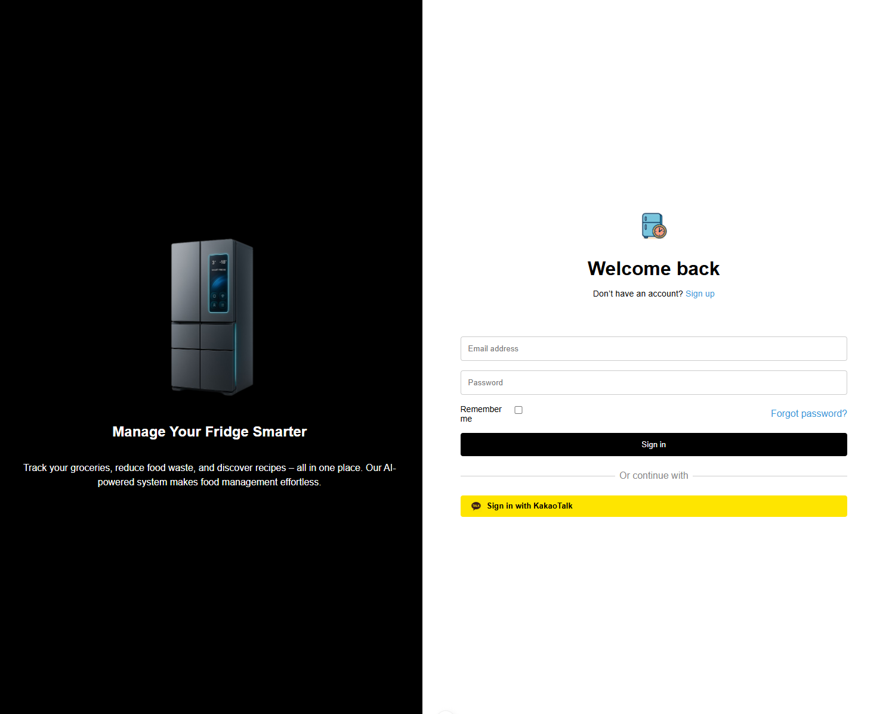
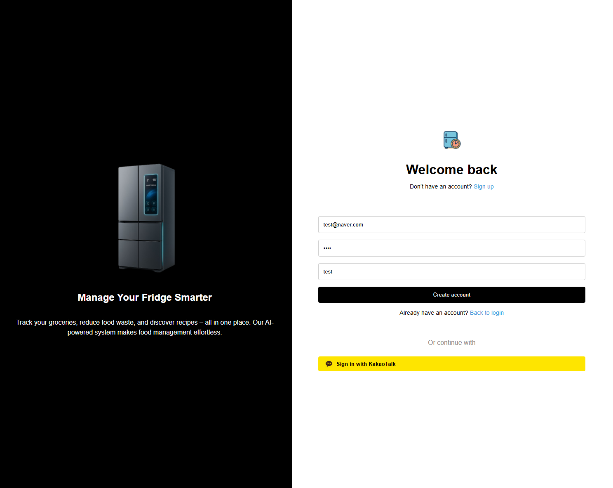
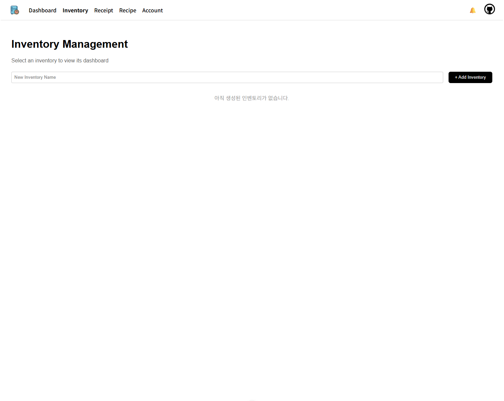
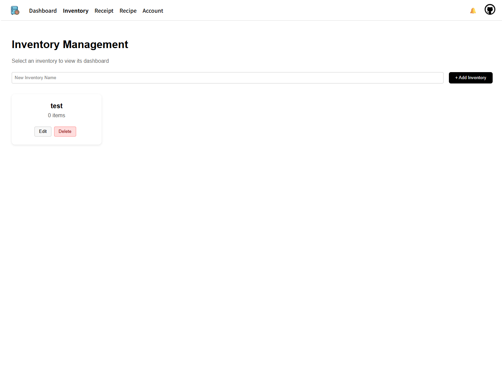
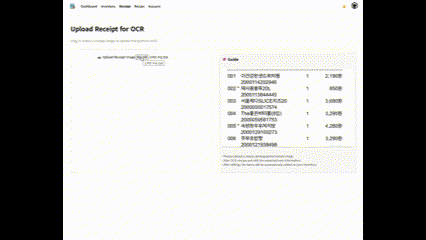
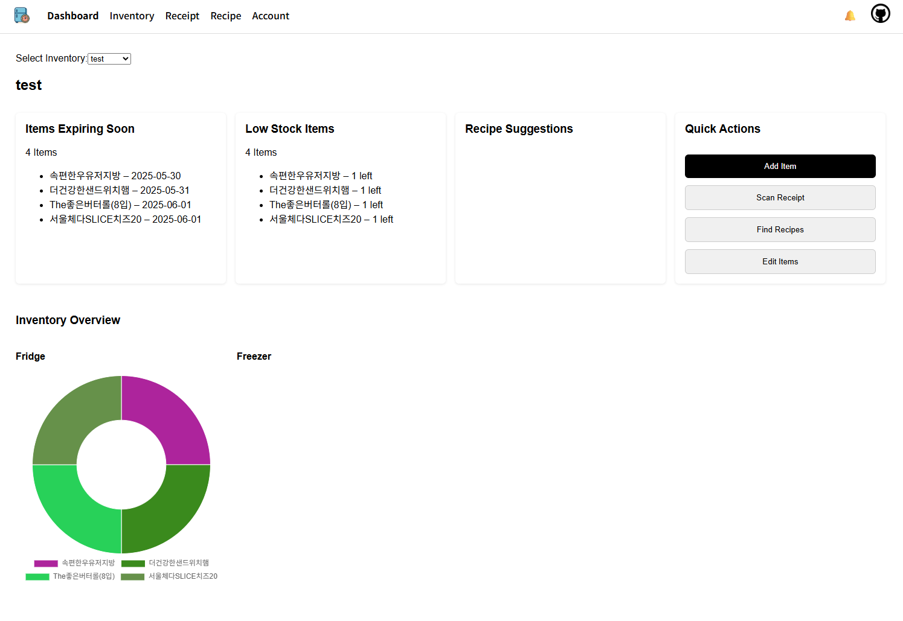
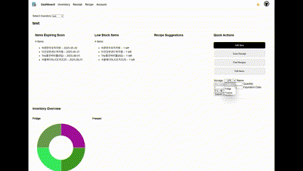
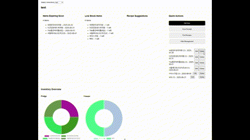

# 냉장고 재고 관리 시스템 - 사용자 가이드

## 개요
이 프로젝트는 냉장고에 있는 재고를 관리하고, 유통기한 임박 항목을 알려줍니다. 주 기능으로는 OCR을 통해 사용자가 영수증 사진을 업로드하면 물품 등록 단계에서 자동 입력이 가능하도록 합니다. 한편, 자신의 재고 리스트를 기반으로 AI 생성 레시피를 제안 받을 수 있습니다.

## 제공 기능 요약

- **🔎 냉장고 선택 및 대시보드 시각화**
  - 사용자가 보유한 인벤토리(냉장고) 목록을 드롭다운으로 선택
  - 선택한 인벤토리에 따라 자동으로 식재료 카드 및 레시피 추천, 도넛 그래프 갱신

- **⏰ 유통기한 임박 재료 알림**
  - 유통기한이 5일 이내인 항목 자동 필터링하여 “Items Expiring Soon” 카드에 표시

- **📦 재고 부족 재료 알림**
  - 수량이 2 이하인 재료를 “Low Stock Items” 카드에 표시

- **📊 식재료 시각화**
  - 냉장/냉동 항목을 분리하여 도넛 그래프로 시각화
  - 각 항목마다 **랜덤한 고유 색상**을 지정하고, 이후에도 고정되도록 구현

- **📋 식재료 직접 추가 및 관리**
  - Add Item 폼을 통해 직접 입력 가능
  - Edit Items 버튼을 통해 재고 수정 및 삭제 가능

- **📸 OCR 영수증 인식**
  - 영수증 이미지 업로드 → OCR로 자동 항목 추출 및 추가

- **🍽 레시피 추천**
  - 현재 재고 기반으로 GPT가 생성 가능한 레시피 추천

 

## 설치 및 실행 (Ubuntu 기준)

> - **FE:** Vue.js 기반
> - **BE:** Spring Boot 기반

 

## 1. 프로젝트 다운로드
<pre>
<code>
$ git clone https://github.com/junjinju/opensource-project.git
</code>
</pre>

 

## 2. 프로젝트 환경 설치
- Node.js 18 이상
- Java 17 이상
- MySQL 8.0 이상
- Git

<pre>
<code>
# Git 설치
sudo apt update
sudo apt install git -y

# Node.js 18.x 설치
curl -fsSL https://deb.nodesource.com/setup_18.x | sudo -E bash -
sudo apt install -y nodejs

# Java 17 설치 (OpenJDK)
sudo apt install openjdk-17-jdk -y

# MySQL 8.0 설치
sudo apt install mysql-server -y
sudo systemctl start mysql
sudo systemctl enable mysql
</code>
</pre>

 

## 3. 프론트엔드 실행
<pre>
<code>
$ cd opensource-project/source-code/front-end
$ npm install
$ npm run dev
</code>
</pre>

 

## 4. 백엔드 실행
<pre>
<code>
$ cd opensource-project/source-code/backend
# 빌드
$ ./gradlew bootJar

# 포어그라운드 실행
$ java -jar build/libs/backend-0.0.1-SNAPSHOT.jar 
# 또는 백그라운드 실행
$ nohup java -jar build/libs/backend-0.0.1-SNAPSHOT.jar > backend.log 2>&1 & 
</code>
</pre>

 

## ✨ 기능 동작 예시

### 로그인 / 회원가입

<table>
  <tr>
    <td></td>
    <td></td>
  </tr>
  <tr>
    <td align="center">1. 로그인 페이지</td>
    <td align="center">2. 회원가입</td>
  </tr>
</table>

---

### 인벤토리 관리

<table>
  <tr>
    <td></td>
    <td></td>
  </tr>
  <tr>
    <td align="center">3. 인벤토리 초기화면</td>
    <td align="center">4. 인벤토리 생성 후(물품 추가 전)</td>
  </tr>
</table>

---

### 영수증 입력

<table>
  <tr>
    <td></td>
    <td></td>
  </tr>
   <tr>
    <td align="center">5. 영수증 등록</td>
    <td align="center">6. 상세정보 입력</td>
  </tr>
  </table>

---

### 대시보드

<table>
  <tr>
    <td></td>
    <td></td>   
  </tr>
   <tr>
    <td align="center">7. 대시보드에서 한 눈에 확인</td>
    <td align="center">8. 아이템 추가</td>
  </tr>
  <tr>
    <td>
  </td>
  <tr>
    <td align="center">9. 아이템 편집</td>
  </tr>
  </table>

  ---

### 레시피 추천

<table>
  <tr>
    <td></td>
  </tr>
   <tr>
    <td align="center">10. 레시피 추천 받기</td>
  </tr>
  </table>